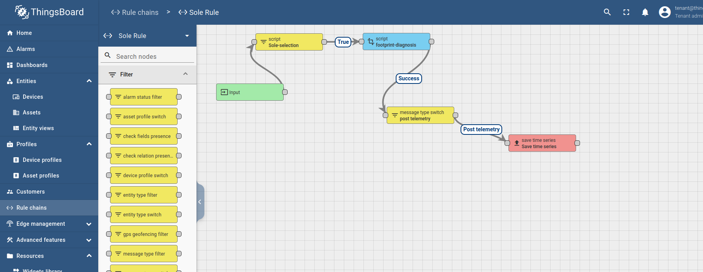

# Guia para configuracion de un dispositivo
## Dispositivo suela
- Entrar al thingsboard como Tenant
- Crear rules si es necesario
- Crear un dashboard de tipo time series para ver todos los eventos
- Crear perfil de dispositivo
- Crear un dispositivo y configurar su comunicacion
  - Ejemplo:
  ```
  sudo apt-get install curl mosquitto-clients
  mosquitto_pub -d -q 1 -h localhost -p 1883 -t v1/devices/me/telemetry -i "sole101" -u "tenant@thingsboard.org" -P "tenant" -m "{temperature:25}"
  ```
  ```
  docker run --rm -it --add-host=host.docker.internal:host-gateway thingsboard/mosquitto-clients mosquitto_pub -d -q 1 -h host.docker.internal -p 1883 -t v1/devices/me/telemetry -i "sole101" -u "tenant@thingsboard.org" -P "tenant" -m "{temperature:25}"
  ```


  ## Capturas de pantalla
  